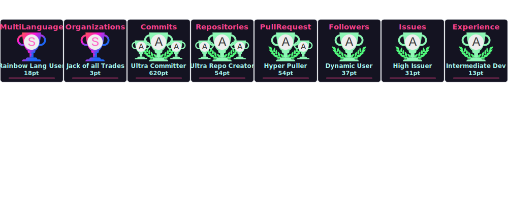

# Hello World

## 🐱‍👤About me
Hi there! My name is Each Chen, I am a Creative Technologist from Taichung, Taiwan. I explore new technologies and build things that make life more efficient — or just more fun.

> Always exploring. Always building.
## links
- [blog✨](https://www.iach.cc)
- [email](mailto:info@iach.cc)
----

🎓 Certifications:
  - [CCNA (Cisco Certified Network Associate)](https://cp.certmetrics.com/cisco/en/public/verify/credential/f49eb3650c284ceaa73beb6efa57e8ea)
  - IPAS (Industry Professional Assessment System)Information Security Engineer
  - NCC Amateur Radio Operator's Certificate (Call sign: BM4LTB)

